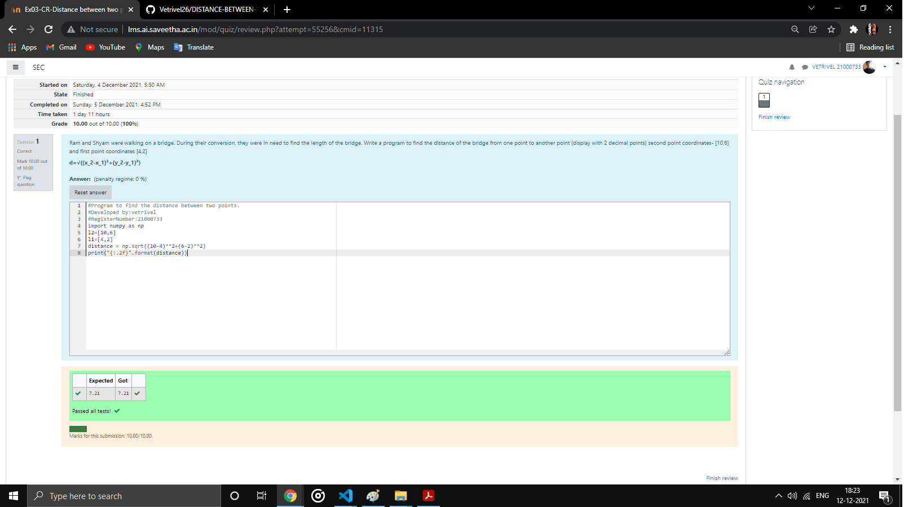

# DISTANCE-BETWEEN-TWO-POINTS

## AIM:
To write a python program to find the distance two 2 points
## ALGORITHM:
### Step 1:
Get the two list forom the user

### Step 2:
import the math module

### Step 3:
Substitute the values in the distance formula formula

### Step 4:
print the value useing the format function

### Step 5:
Stop the program 
### PROGRAM:
~~~
import numpy as np
l2=[10,6]
l1=[4,2]
distance = np.sqrt((10-4)**2+(6-2)**2)
print("{:.2f}".format(distance))
~~~
### OUTPUT:

### RESULT:
Thus the distance between two points is executed
